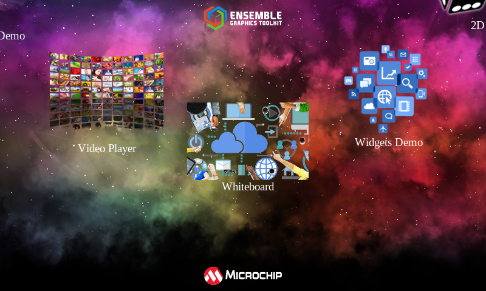

# EGT Launcher Application

A dazzling and interactive application launcher or home menu written using the
[Ensemble Graphics Toolkit (EGT)](https://github.com/linux4sam/egt) for the GUI.

The launcher searches for any number of XML files at startup which describe
another process to launch - it's binary, arguments, description, and an icon.
The launcher then manages switching between these processes and the launcher
itself using some awe-inspiring martial arts.  The [example.xml](example.xml)
file shows the basic format of the XML.

## License

Released under the terms of the `Apache 2` license. See the [COPYING](COPYING)
file for more information.
